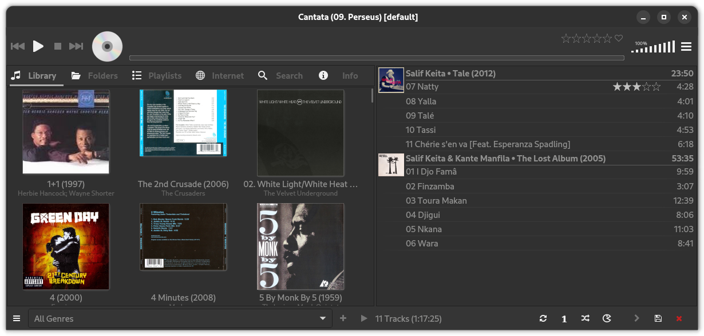

Cantata
=======

**NOTE** This is my personal fork of [CDrummond/cantata](https://github.com/CDrummond/cantata), which is now archived.

A graphical (Qt5) client for MPD, supporting the following features:

  1. Supports Linux, macOS, Windows, and Haiku. **NOTE:** Only Linux actively supported as of 2.3.3
  2. Multiple MPD collections.
  3. Highly customisable layout.
  4. Songs (optionally) grouped by album in play queue.
  5. Context view to show artist, album, and song information of current track.
  6. Simple tag editor.
  7. File organizer - use tags to organize files and folders.
  8. Ability to calculate ReplyGain tags. (Linux only, and if relevant libraries installed)
  9. Dynamic playlists.
 10. Smart Playlists.
 11. Online services; Jamendo, Magnatune, SoundCloud, and Podcasts.
 12. Radio stream support - with the ability to search for streams via TuneIn, ShoutCast, or Dirble.
 13. USB-Mass-Storage and MTP device support. (Linux only, and if relevant libraries installed)
 14. Audio CD ripping and playback. (Linux only, and if relevant libraries installed)
 15. Playback of non-MPD songs - via simple in-built HTTP server.
 16. MPRISv2 DBUS interface.
 17. Ratings support.
 18. "Partitions" support.

Cantata started off as a fork of QtMPC, however, the code (and user interface) is now *very* different to that of QtMPC.
For more detailed information, please refer to the main [README](https://raw.githubusercontent.com/CDrummond/cantata/master/README)

# Downloads

I use this version of cantata on my macbook, mac mini, Raspberry PIs and a Fedora laptop. I have also built a streamer, based on a Raspberry PI, with a LCD screen attached. I use Cantata on this raspberry PI to control Music playback on my Stereo Amplifier and a 7.1 AVR. On this raspberry PI, I use LIRC with an IR remote to control Cantata. You can download this version of cantata for Few of the Linux distributions (Debian, Fedora, Raspbian, Ubuntu) from [open build service](https://software.opensuse.org//download.html?project=home%3Ambhangui%3Araspi&package=cantata). I do have the same version built for MacOS (built on Sonoma), but not sure where and how to upload it to github. I do not have any windows machine and neither have much knowledge of windows. I haven't yet seen a better mpd client than Cantata and would hate to see it dead and hence I have decided to keep it alive as long as I can.
